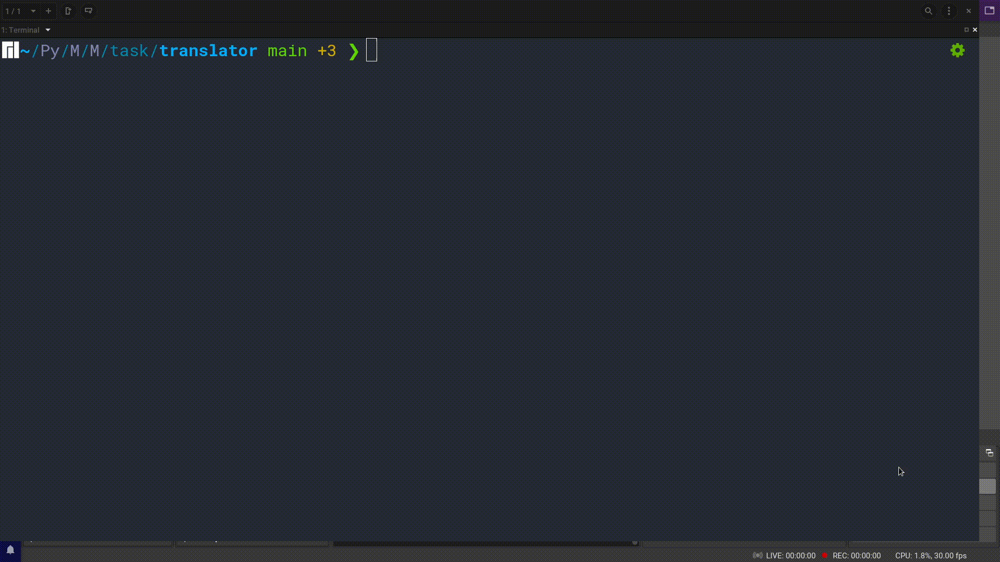

# Multilingual Online Translator
A CLI based language translator built using BeautifulSoup, requests and argparse module.

- The program takes and parses the command line input and then based on the language, uses [Reverso Context](https://context.reverso.net/translation/) to send an HTTP request to translate. 
- The response is then recieved and parsed with BeautifulSoup to give the translations along with the examples of that word.
- The response is also saved in a text file for future reference

